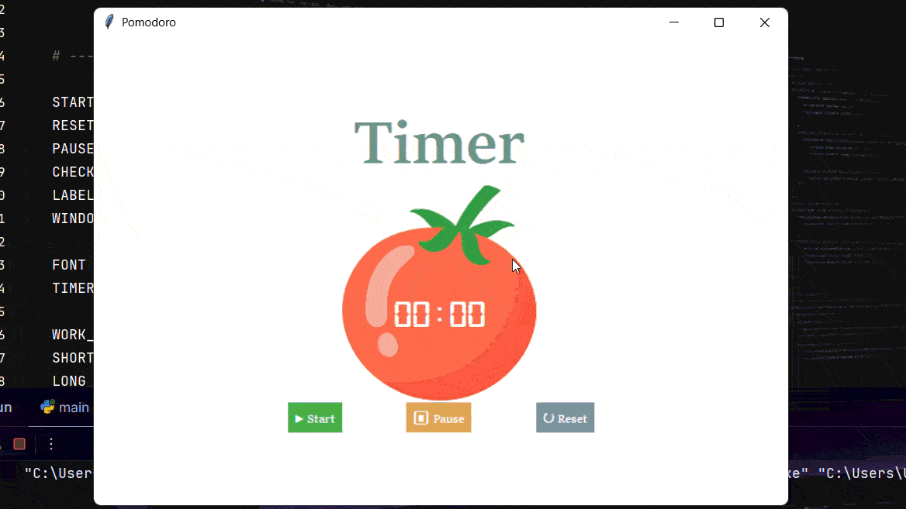

# Pomodoro Timer

A desktop Pomodoro timer built with Python and Tkinter.

The project started as a basic countdown timer and was extended to handle automatic work/break cycles, pause and resume, reset, session tracking, and completion marks.

## Demo



## Features

* 25-minute work sessions
* 5-minute short breaks
* 20-minute long break after four work sessions
* Automatic transition between work and break sessions
* Pause and resume from the remaining time
* Reset the current session and progress
* Prevents multiple countdowns from running when Start is pressed repeatedly
* Displays completed work sessions using check marks
* Updates the GUI without freezing the application

## How it works

The timer is divided into two main responsibilities:

* `start_timer()` decides which session should run based on the current number of repetitions.
* `countdown()` handles the actual countdown and updates the timer display.

The Pomodoro cycle is controlled using the `reps` counter:

```text
Work
  ↓
Short Break
  ↓
Work
  ↓
Short Break
  ↓
Work
  ↓
Short Break
  ↓
Work
  ↓
Long Break
  ↓
Repeat
```

Every eighth repetition starts the long break, while even repetitions start short breaks and odd repetitions start work sessions.

## Pause and Resume

Tkinter's `after()` method is used to schedule the next countdown step.

Instead of using a blocking loop, the timer schedules itself to run again after one second:

```python
timer = window.after(1000, countdown, count - 1)
```

This keeps the GUI responsive while the timer is running.

When Pause is pressed, the scheduled callback is cancelled and the current value is stored in `remaining_time`.

When Start is pressed again, the countdown resumes from that saved value instead of starting a new session.

## Timer State

The project uses a small amount of state to control the timer:

* `timer` stores the current Tkinter `after()` callback ID.
* `remaining_time` stores the current countdown value.
* `is_paused` tells the program whether Start should resume a paused timer.
* `reps` keeps track of the Pomodoro cycle.

The `timer` value is also used to prevent multiple countdown callbacks from being created when Start is pressed repeatedly.

## Reset

Reset cancels the active timer when one exists and clears the current session state.

It resets:

* Timer display
* Session title
* Completed work marks
* Repetition count
* Remaining time
* Pause state

This allows the application to start a completely new Pomodoro cycle.

## Tech Stack

* Python 3
* Tkinter
* `after()` event scheduling
* Basic state management with Python variables
* Git and GitHub

## Project Structure

```text
pomodoro-timer/
│
├── main.py
├── tomato.png
├── README.md
└── assets/
    └── demo.gif
```

## Running the Project

Make sure Python 3 is installed.

Clone the repository:

```bash
git clone https://github.com/Anjan7797/pomodoro-timer.git
```

Move into the project directory:

```bash
cd pomodoro-timer
```

Run the application:

```bash
python main.py
```

Tkinter is included with standard Python installations on Windows, so no external GUI package is required.

## What I Practiced

This project was mainly used to understand how a GUI application manages time-based events.

While building it, I worked through:

* Tkinter widgets and layout
* Functions and global state
* Event-driven programming
* `window.after()` and callback scheduling
* Separating timer selection from countdown logic
* Saving and restoring state for pause/resume
* Cancelling scheduled callbacks
* Handling repeated button presses
* Resetting application state
* Debugging timer-related edge cases

The final version is intentionally kept simple rather than adding unnecessary features. The focus is on understanding the underlying logic and making the timer behave reliably.

## Future Improvements

Possible additions for a later version:

* Configurable work and break durations
* Pause button state changes
* Better handling of application closing while a timer is running
* Sound notification when a session finishes
* A settings section for custom Pomodoro cycles

## Author

**Anjan Mistry**

GitHub: [Anjan7797](https://github.com/Anjan7797)
